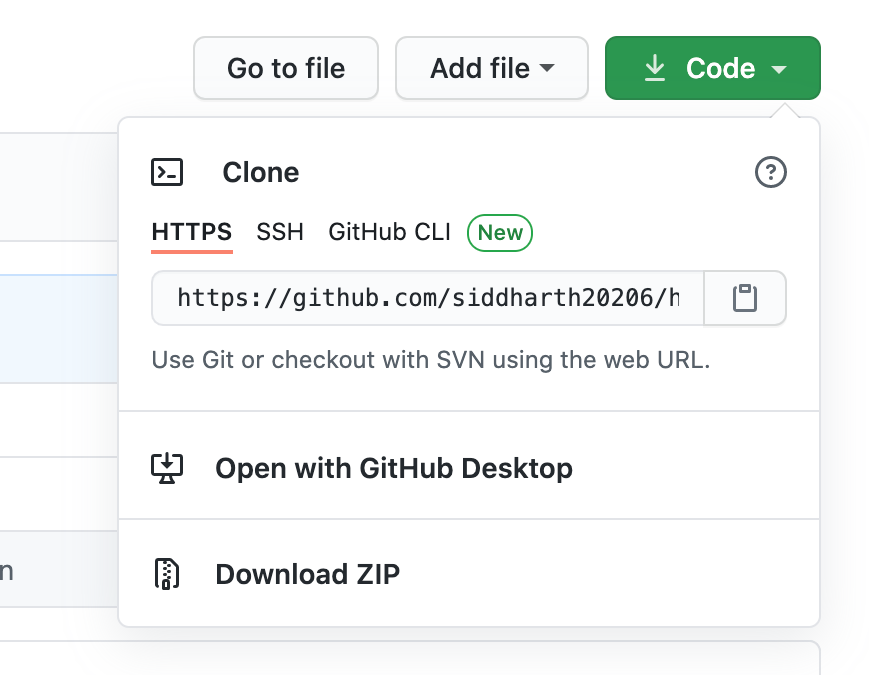
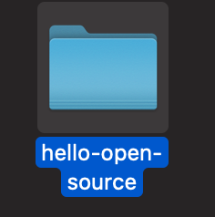
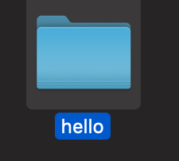
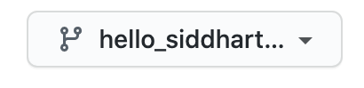
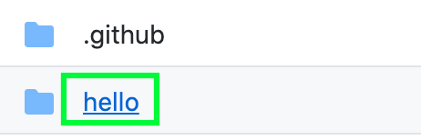
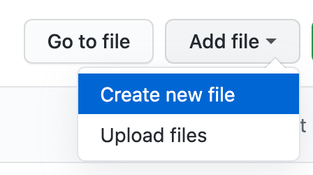
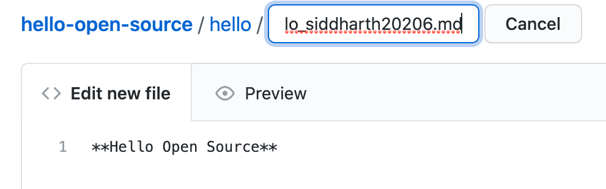
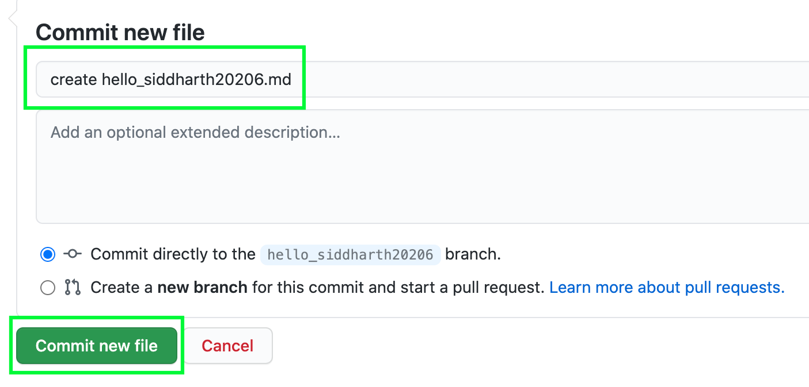
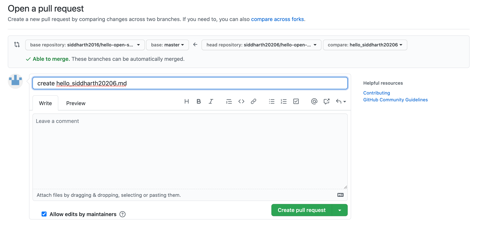

# hello-open-source

This repository is meant to help people who are just starting with Open Source and are trying to figure out how to make contributions to other projects.

I know, there are a lot of other repositories out there to make you comfortable with Open Source contributions, but that is the beauty of it ! When you go Open Source, you will find a lot of like minded people working together, making the community strong, helping each other with their problem (most of the time similar problem) and giving back to the community.

## Before Starting the Next Steps

**Make sure you have read *CONTRIBUTING.md* in *.github* folder of this repository.**

*[What is .github ?](https://stackoverflow.com/questions/60507097/is-there-an-overview-of-what-can-go-into-a-github-dot-github-directory#:~:text=On%20Github%2C%20folder%20.,%2C%20CODE_OF_CONDUCT.md%20etc)* 

## Next Steps

Please follow next points step-by-step to register your first PR and do a contribution to this repository:

1. [Using Terminal/Command Prompt](https://github.com/siddharth2016/hello-open-source#first-contributions-using-terminal-and-git)
2. [Using GitHub Directly](https://github.com/siddharth2016/hello-open-source#first-contributions-using-github-directly)
3. [Check Other Repositories](https://github.com/siddharth2016/hello-open-source#check-other-repositories)


## First Contributions Using Terminal and Git

*This will go through creating a local repository on your computer and using terminal to do most of the work.*

### ☞ First Fork this repository (fork button on top right corner of this repository)


Then we need to clone the forked repository (the same repository have been created under your username, **\<your-username\>/hello-open-source**).

### ☞ Copy the **https** link after clicking Code (to clone repository in local)



### ☞ Now Open terminal/command prompt in your preferred directory

I will be doing that in Documents, you can create your own folder to keep all your projects at one place (please make sure [git](https://git-scm.com/book/en/v2/Getting-Started-Installing-Git) is installed on your machine).

### ☞ Write following commands on terminal/command prompt

```bash 
git clone <https-link-you-copied>
```

It will look something like this

```bash
git clone https://github.com/siddharth20206/hello-open-source.git
```

### ☞ Let's, [checkout](https://git-scm.com/docs/git-checkout) to a branch (it will start pointing to a branch instead of master/main)

Change directory to cloned repository

```bash
cd hello-open-source
```

```bash
git checkout -b <your-branch-name>
```

Something like this

```bash
git checkout -b hello_siddharth20206
```

Verify you did it right

```bash
git status
```

Press enter and you should see something like this

```bash
On branch hello_siddharth20206
nothing to commit, working tree clean
```

Look at the directory/location where you cloned the repository, you should be able to see a folder named hello-open-source. Open this folder.



Now open folder named hello.



**Create a new file inside that folder, that file can be any text file, python file, java file, markdown file or any other file as long as it's content shows/print Hello Open Source (or hello open source).**

**Now before saving your file, please follow this naming convention - hello_\<your-github-username\>.\<file-extension\>.**

**Here, enter your github username (like siddharth20206) in place of *\<your-github-username\>* and file extension (either txt, md, py, java, c, cpp etc..) in place of \<file-extension\>.**

Following are the example of python file, text file and markdown file content (please make sure you write it yourself to make a habit, otherwise you are free to copy !).

**Python (.py)**

```python
print("Hello Open Source")
```

**Text (.txt)**
```text
Hello Open Source
```

**Markdown (.md)**
```markdown
**Hello Open Source**
```

**Make sure your file shows Hello Open Source, either by printing it out as a program or simply a comment in that file (it is a necessary requirement for your PR to be merged with this repository).**


<br />

Go to terminal, type this and press enter

```bash
git status
```

You should see something like this

```bash
On branch hello_siddharth20206
Untracked files:
  (use "git add <file>..." to include in what will be committed)
	.DS_Store
	hello/hello_siddharth20206.py

nothing added to commit but untracked files present (use "git add" to track)
```

### ☞ It means you have some changes that are not [staged](https://git-scm.com/book/en/v2/Git-Basics-Recording-Changes-to-the-Repository) yet, which we need to do next !

Type the following on terminal/command prompt and press enter

```bash
git add hello/hello_<your-github-username>.<file-extension>
```

Something like this

```bash
git add hello/hello_siddharth20206.py
```

Now you have added the file to staging area. Next comes writing the commit message, make it meaningful (even though you are doing this for the first time, it's better to do practice on writing good commit messages from start itself).

```bash
git commit -m "create hello_siddharth20206.py"
```

### ☞ Push to remote repository

Now you committed the file with a proper message, but the changes are still in your local repository, we need to push them to remote repository. (yes, to the one you forked)

```bash
git push origin <your-branch-name>
```

Here origin is your forked repository reference and \<your-branch-name\> is where your changes will be pushed to remote location.

Something like this

```bash
git push origin hello_siddharth20206
```

Excellent, all that remains now is to create a pull request, go back to your github forked repository and you should be able to see something like this.


### ☞ Click on Compare & pull request 

It will allow your changes to be merged with master branch of actual repository **siddharth2016/hello-open-source**.

Write a meaningful PR message like this

```text
create hello_siddharth20206
```

### ☞ Now submit your PR and I will review it within 24 hrours

Later when this repository gets updated, please make sure your forked repository is in perfect [sync](https://github.com/Logic-Xcution/Kickoff-To-Open-Source#additional-details-keeping-your-fork-synced-with-original-repository) with the actual current repository (siddharth2016/hello-open-source) or you can delete it after successful contribution !

## First Contributions Using GitHub Directly

*The following steps will focus on how you can create your first PR and do contribution using GitHub alone.*

### ☞ First Fork this repository (fork button on top right corner of this repository)


The same repository have been created under your username, **\<your-username\>/hello-open-source**.

### ☞ Create a branch on your forked repository. Give any name you like !


### ☞ Make sure your forked repository is pointing to the branch you created



### ☞ Go to *hello* folder



### ☞ Create new file



### ☞ Add contents to the file

**Now before committing your file, please follow this naming convention - hello_\<your-github-username\>.\<file-extension\>.**

**Here, enter your github username (like siddharth20206) in place of *\<your-github-username\>* and file extension (either txt, md, py, java, c, cpp etc..) in place of \<file-extension\>.**

Following are the example of python file, text file and markdown file content (please make sure you write it yourself to make a habit, otherwise you are free to copy !).

**Python (.py)**

```python
print("Hello Open Source")
```

**Text (.txt)**
```text
Hello Open Source
```

**Markdown (.md)**
```markdown
**Hello Open Source**
```

**Make sure your file shows Hello Open Source, either by printing it out as a program or simply a comment in that file (it is a necessary requirement for your PR to be merged with this repository).**



**Next comes writing the commit message, make it meaningful (even though you are doing this for the first time, it's better to do practice on writing good commit messages from start itself).**



### ☞ Commit the file and check head of forked repository again

You should see something like this


### ☞ Click on Compare & pull request 

It will allow your changes to be merged with master branch of actual repository **siddharth2016/hello-open-source**.

Write a meaningful PR message like this



### ☞ Now submit your PR and I will review it within 24 hrours

## Check Other Repositories

*Following repositories could be your next stop to further practice creating a PR and do a contribution.*

[First Contributions](https://github.com/firstcontributions/first-contributions)

[KickOff To Open Source](https://github.com/Logic-Xcution/Kickoff-To-Open-Source)

<hr />

Wait for at most 24 hours to see your first contribution on your profile !

That's it, if you followed the above steps, you should have been able to create your first PR and your first contribution to Open Source !

#### It would be kind of you to spread the word, give this repo a star and help others in their open source journey.
